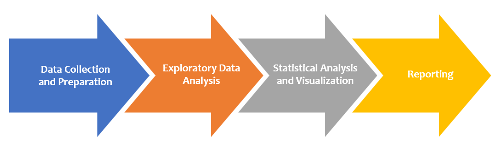

# Project Plan

## Title
Comparative Analysis of Registered Trees in Cologne and Frankfurt (2020)

## Summary and Rationale
The project aims to conduct a comparative analysis of the number of registered trees in Cologne and Frankfurt for the year 2020. Understanding the differences and
similarities in tree populations between these two cities can provide valuable insights into urban forestry and environmental management. This analysis will
utilize data from two distinct datasets, one for Cologne and another for Frankfurt.
The project will employ data science methodologies and statistical techniques to explore and visualize the tree data. By examining factors such as tree species
distribution, Age distribution, Trunk diameter distribution, Height distribution, and geographic distribution, the project aims to answer the main question regarding the comparative tree populations.

## Main Questions
1. What is the distribution of age of trees in the region of Colonge and Frankfurt for the year 2020?
2. What is the distribution of height of trees in the region of Colonge and Frankfurt for the year 2020?
3. What is the distribution of trunk diameter of trees in the region of Colonge and Frankfurt for the year 2020?
4. Analyses of type of trees in the region of Cologne and Frankfurt for the year 2020.
5. Geographical visualization of Registers tree in both regions for the year 2020?
6. What the density of trees per square km in both the region?

## Datasources
### Datasource1: Cologne tree register
* Metadata URL: https://offenedaten-koeln.de/dataset
* Data URL: https://offenedaten-koeln.de/sites/default/files/Bestand_Einzelbaeume_Koeln_0.csv
* Data Type: CSV

The Cologne Tree Register dataset provides comprehensive information on the tree population within the city of Cologne, Germany. It includes data on tree species,
location, and other attributes, offering insights into urban forestry and environmental management in the region.

### Datasource1: Tree register Frankfurt am Main (2020)
* Metadata URL: https://www.offenedaten.frankfurt.de/dataset
* Data URL: https://offenedaten.frankfurt.de/dataset/73c5a6b3-c033-4dad-bb7d-8783427dd233/resource/e53aacb4-4462-4b69-ab9f-4252a402a082/download/baumauswahl_veroffentlichung_8-berbeitetrkr.csv
* Data Type: CSV

The "Tree Register Frankfurt am Main (2020)" dataset provides comprehensive information on the city's tree inventory for the year 2020, offering details on tree species, location, and more. This dataset is a valuable resource for environmental analysis and urban forestry research.

## Work Packages
### Project flow

### Description
1. Data Collection and Preparation
   - Acquire and clean the tree datasets for both Cologne and Frankfurt.
   - Merge and prepare the data for analysis.

2. Exploratory Data Analysis (EDA)
   - Conduct EDA to understand the distribution of tree species and other relevant attributes.

3. Statistical Analysis and Visualization
   - Create visual reports to present the findings of the comparative analysis.
   - Perform statistical tests to compare the tree populations in Cologne and Frankfurt.
   - Identify significant differences and trends.

4. Reporting
   - Prepare a project report and visual summaries.
  

